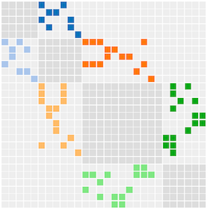

# LSST Dark Matter Graphic

This web application uses [D3.js](https://d3js.org/) to visualize the intertwined elements about probing the nature of dark matter with LSST.

The design concept largely comes from coversations between
[@kadrlica](https://github.com/kadrlica),
[@aimalz](https://github.com/aimalz), and
[@yymao](https://yymao.github.io/)
during the 2017 LSST DESC Sprint Week at ANL (see the discussions in
[#9](https://github.com/LSSTDESC/LSSTDarkMatter/issues/9),
[#10](https://github.com/LSSTDESC/LSSTDarkMatter/issues/10),
[#11](https://github.com/LSSTDESC/LSSTDarkMatter/issues/11),
[#13](https://github.com/LSSTDESC/LSSTDarkMatter/issues/13), and
[this table](https://github.com/LSSTDESC/LSSTDarkMatter/blob/master/table.md) in
[LSSTDESC/LSSTDarkMatter](https://github.com/LSSTDESC/LSSTDarkMatter)),
and also their conversations with
[@sazabi4](https://github.com/sazabi4) and
[@wadawson](https://github.com/wadawson).

Current web app development is led by [@yymao](https://yymao.github.io/)
with content curated by [@kadrlica](https://github.com/kadrlica).
We hope to see more contribution from the community.

<table>
  <tr>
    <td><b><a href=https://lsstdarkmatter.github.io/dark-matter-graph/network.html>Click to see the network diagram</a></b></td>
    <td><b><a href=https://lsstdarkmatter.github.io/dark-matter-graph/matrix.html>Click to see the adjacency matrix</a></b></td>
  </tr>
  <tr/>
  <tr>
    <td><a href="https://lsstdarkmatter.github.io/dark-matter-graph/network.html"></a></td>
    <td><a href="https://lsstdarkmatter.github.io/dark-matter-graph/matrix.html"></a></td>
  </tr>
  <tr/>
  <tr>
    <td colspan="2" align="center"><b><a href=https://docs.google.com/forms/d/e/1FAIpQLSfkUCE7o8cqQQV9PFki484sSqRzelTDEk1SXtwb7I2d4gxxTw/viewform>Click to submit a new idea</a></b></td>
  </tr>
</table>

## Local Installation

Below are local installation instructions for developers.

1. Clone this repo:
   ```
   git clone https://github.com/lsstdarkmatter/dark-matter-graph.git
   cd dark-matter-graph
   ```
   Or update your local clone if you already have one:
   ```
   cd dark-matter-graph
   git pull
   ```

2. (Optional) Edit `data/data.yaml`, and then convert it to the json file by running:
   ```
   data/prepare_data.py
   ```
   ([See this readme](data/README.md) to learn more the format of `data.yaml` and `data.json`.)

   _Note: this step is slow because it connects to ADS online to resolve references.
   To speed things up for testing purposes, add option `--no-ads` to the command._

3. Start a Python http server:
   ```
   ./server.py
   ```
   Direct your browser to the URL the above command returns.
   Press `ctrl` + `c` to exit.
